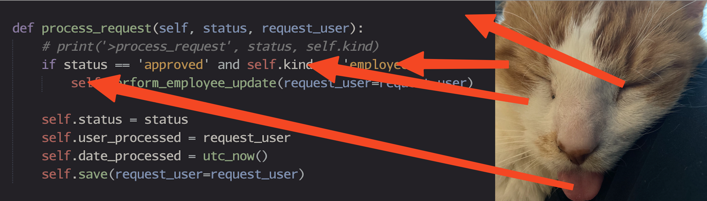

# Hobbes Theme - Multi-Editor Color Schemes

This repository contains the **Hobbes** color scheme converted for various popular code editors and terminals. The dark theme is based on a warm, earthy palette inspired by the colors of Hobbes the cat, who is a good boy.

## Color Legend

## Color Palette

The Hobbes theme uses these core colors:

- **Orange Fur** (`#d39f58`) - Classes, highlights, selection foreground
- **White Fur** (`#b1aea8`) - Default text, punctuation
- **Hazel Eye** (`#a19366`) - Strings, numbers
- **Pink Nose** (`#ad8178`) - Keywords, constants
- **Red Tongue** (`#a15953`) - Errors, warnings, Python `self`
- **Black Eye** (`#201e22`) - Background, base color
- **Midnight** (`#2a282c`) - Line highlights, selections
- **Gray** (`#6b6a64`) - Comments, muted text
- **Catnip** (`#869c78`) - Functions, success states
- **Water** (`#7587a6`) - Variables, links, blue accents

## License

MIT

---

**Note**: Some editors may require additional configuration or plugins for full theme support. Please refer to your editor's documentation for specific setup instructions. 
